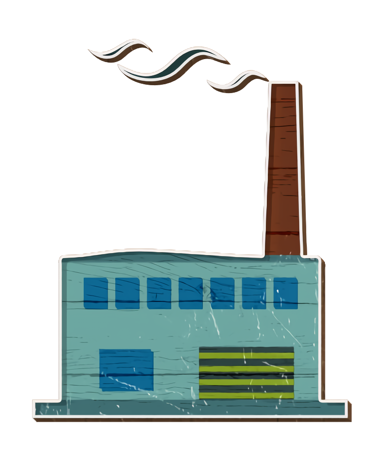

---
title: "Test Message Boxes"
output: html_document
---

```{css, echo=FALSE}
.message-box {
  border: 1px solid red;
  margin-bottom: 10px;
  padding: 10px;
}
.message-box .header {
  font-weight: bold;
  margin-bottom: 10px;
}
.message-box .content {
  display: flex;
  align-items: flex-start;
}
.message-box .icon {
  margin-right: 10px;
}
.message-box .text {
  flex: 1;
}
.message-box .action-title {
  font-weight: bold;
  text-transform: uppercase;
  margin-bottom: 5px;
}
.message-box .action-text {
  font-size: 0.9em;
}
```

```{r test_message_boxes, echo=FALSE, results='asis'}
# Sample messages
report_messages <- c(
  "You had Industrial & Commercial Chemicals compound, Indole detected at a high level that was not found in most other wristbands.",
  "You had a higher level of Agricultural & Pharmaceutical Chemicals compound, Diethyl phthalate, compared to 95% of other people in the study.",
  "You had Consumer & Personal Care Products compound, Indole detected at a high level that was not found in most other wristbands."
)

# Build the HTML output as a single string
html_output <- "<h2>Key Messages</h2>
<p>Chemicals are often grouped based on how we’re exposed to them—through breathing, skin contact, or what we eat—and how we can avoid them, like washing hands, improving ventilation, or restricting certain products. Here are some key points from your results. Keep in mind that a chemical might show up in more than one group since chemicals can come from different sources.</p>"

for (msg in report_messages) {
  html_output <- paste0(
    html_output,
    "<div class='message-box'>",
      "<div class='header'>", msg, "</div>",
      "<div class='content'>",
        "<div class='icon'></div>",
        "<div class='text'>",
          "<div class='action-title'>WHAT YOU CAN DO</div>",
          "<div class='action-text'>Placeholder recommendation text goes here. Replace this with your dynamic content.</div>",
        "</div>",
      "</div>",
    "</div>"
  )
}

cat(html_output)
```
